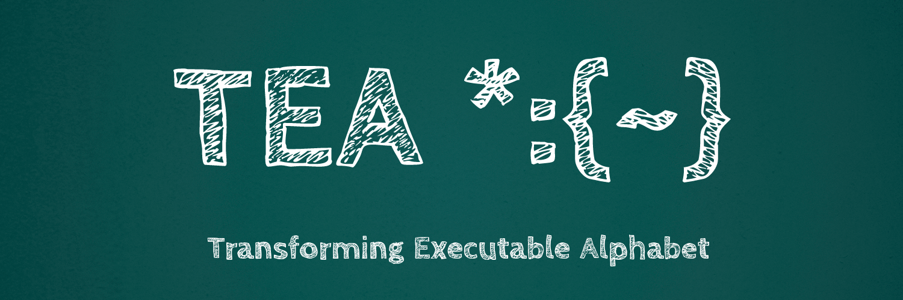
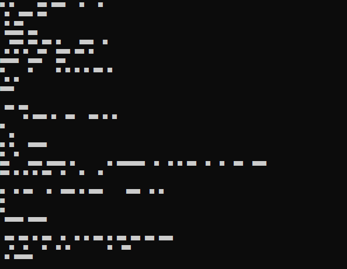
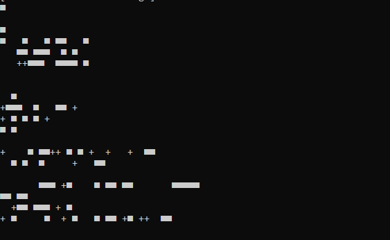

 TEA is the **T**ransforming **E**xecutable **A**lphabet; a generic computer programming language leveraging Text Processing methods, via a set of 26 primitives, A: to Z:, based on the standard Latin Alphabet.

 For those entirely new to this language, please note that TEA is very well documented and those just getting started can consult the official TEA documentation via:

1. The [docs/](docs/) path under the RI for TEA: https://github.com/mcnemssis/cli_tttt
2. **The TAZ**: https://bit.ly/thetaz
3. Study the sample TEA programs and standard tests included as part of the TTTT project.

--------------------------------------------------------------------

# TTTT? 

 To run or try out TEA programs, one needs a suitable operating environment for the TEA programming language. For TEA, the official SOE is TTTT---**TEA Text Transformer Terminal**, also the official Interpreter/runtime for TEA programs.

 The original/historically older TEA implementation is found in the TTTT Android app
 accessible via https://bit.ly/grabteas [down atm] or [TTTT App repo](https://bitbucket.org/nuchwezilabs/tttexttransformer/)

 Currently, focus is on fully defining, implementing and testing the TEA language starndard, and this is mostly taking place as part of this command-line reference implementation of TTTT. 

 TTTT is meant to be the official reference implementation of a TEA interpreter and it is also meant to support the
 availability of TEA on all major operating systems, by creating a standalone
 TEA interpreter that can be utilized in scripts, standalone programs and/or the commandline. 


## A TEA RI?

 Especially for advanced users, language researchers and enthusiasts interested, note that, as part of the TTTT UNIX/Linux package, TEA is here implemented as an interpreted language,
 using the Python programming language as the base/host language.
 
 For this matter, it might also be useful for advanced users, to know that for the current TEA Reference Implementation, TEA RI, there is also the option of embedding TEA into other language source-code, especially python programs as a library or imported module. More about this later...

### CORE IMPLEMENTOR: Joseph W. Lutalo (jwl@nuchwezi.com, joewillrich@gmail.com)

# QUICK TIPS:

1. To INSTALL TTTT and the TEA language on your system, run the following command in your terminal:

   > curl -Ls https://bit.ly/installtea | bash

2. To See TEA documentation and some example programs:

   > man tttt

# Some TEA Highlights 

- TEA is well documented --- TTTT package comes with a useful man page


### TEA is intuitive, powerful and terse!

Let us quickly look at some interesting highlights of TEA programming...

- **Hello World in TEA?**

```python
i:Hello World
```
A more involved Hello World, that for example greets someone with the user-provided name is written as such:

```python
i:{What is your name please? }|i:|x:{Hello }
```


To learn more about the TEA syntax and the semantics of each of the 26 TEA A: to Z: primitives, definitely checkout [**The TAZ**](docs/). We might for example re-write the above program as such:

```python
i:{What is your name please? }
i:
x:{Hello }
```

- **Implementing RNGs in TEA:** [DIA RNG Example](sample_TEA_programs/the_dia_rng_generator.tea)

```python
i!:123456789 0
a!:
d:[ ].*$
```
Some sample outputs...


- **Implementing ART in TEA:** [rCHURCHY City SKYLINE Example](sample_TEA_programs/rchurchy_city_skyline_generator.tea)

```python
i:123456789 0
a!:
r:[2357]:0 987654321
a!:
d:[ ].*$
d:^0+
r!:[0]:● ● ● ● ● ● ● ● ● ●
r!:[19]:■■■■■■■■
r!:[28]:□□□□□□□□
r!:[37]:     ■■■■■
#r!:[46]:□□●□□
r!:[4]:□□●□□
r!:5:▪︎
r!:6:+
t!:
a!:
```
Some sample outputs...





- **Implementing SELF-modifying program in TEA:** [TEA code-injection example](tests/test_e_extended.tea)

```python
i!:ABC

l:lHEW
h:

e!:{
    v:
    v:vE:XYZ
    |v!:
    |v:vOL
    |g*:-< >-:vE:vOL
    |v:vMIX
    |l:lGEN
    |p!:5
    |x*:vMIX
    |f:ai:lMASK
    |l:lSALT
    |s:1_0_1
    |f!:a1:lGEN
    |v:vFIN
    |y: |g!:++|x*!:vFIN
    |q!:
    }

l:lMASK
g!:**
```

This example not only demonstrates all the tricky aspects of a TEA program, however, it is a great example for how to create self-modifying TEA programs. Essentially, all the TEA code inside the e!:{…} block ends up not being processed as an external TEA program, but gets injected into the main program, and uses its AI and existing label blocks! This program will for example return a string starting with the injected sub-string “XYZ” such as “XYZ**5uaikq” if the injected program reached a state where the AI contains the sub-string “ai”, otherwise will return a string starting with “A++B++C” such as “A++B++CXYZ-< >-5hlca1_0_1x” in case the program reached a state where the AI contains the substring “a1”.


- **Implementing Web API-Client program in TEA:** [TEA Web Client example](tests/test_w.tea)

```python
# Example Web API Client program in TEA
# simply performs HTTP post of all data in 
# vaults to specified URL endpoint..
v:A:123|v:vTest:{some value}|i:http://httpbin.org/get|w*:
```

This simple example returns the following:

```JSON
{
  "args": {
    "A": "123",
    "vTest": "some value"
  },
  "headers": {
    "Accept-Encoding": "identity",
    "Host": "httpbin.org",
    "User-Agent": "Python-urllib/3.10",
    "X-Amzn-Trace-Id": "Root=1-66e83270-3b60046b209555b836c85bb8"
  },
  "origin": "41.210.159.193",
  "url": "http://httpbin.org/get?A=123&vTest=some+value"
}
```


# TTTT conforms to the UNIX/Linux CLI Design Philosophy

To make it simple and meaningful to immediately, easily utilize TEA programs in the context of other, existing tools, languages and systems, TEA comes equipped with a useful and clean command-line interface as documented below..

## The TTTT CLI


> echo INPUT | tttt

INPUT is considered to be a valid TEA program (possibly already containing its input), and is executed as such

Or with

> echo INPUT | tttt -c CODE

Where INPUT is treated as input data and the TEA program is read from the string CODE

Or with

> echo INPUT | tttt -fc FCODE

Where INPUT is treated as input data and the TEA program is read from the file path FCODE

Or with

> tttt -i INPUT -c CODE

Where INPUT is treated as input data and the TEA program is read from the string CODE

Or with

> tttt -i INPUT -fc FCODE

Where INPUT is treated as input data and the TEA program is read from the file path FCODE

Or with

> tttt -fi INPUT -fc FCODE

Where INPUT is treated as data input file path and the TEA program is read from the file path FCODE

Typically, the TEA interpreter executes the available TEA program on the available input data (or none) and outputs the final result via standard output, and does nothing else but quit. Of course, because TEA is also an interactive language, it is possible that a TEA program prompts for user-input at runtime, and thus blocks any further processing until such input is provided. Check the docs and official tests for advanced and or non-trivial TEA program examples.

# TESTS

This Reference Implementation comes with several useful test cases, test programs and input data included in the official project's repository. This, so anyone trying out TEA for the first time, or advanced users in need of forking the project, testing edge-cases, implementing advanced TEA integration into their own projects and such, can have somewhere to start. Check the official test cases via the [tests/](tests/) path on the project's official Git Repository.

https://github.com/mcnemesis/cli_tttt/tree/master/tests/

